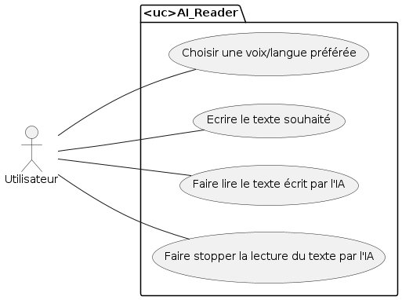
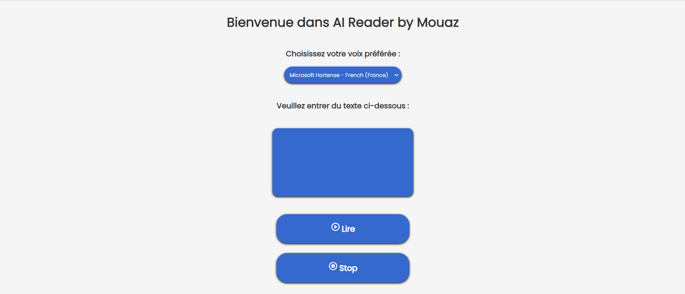
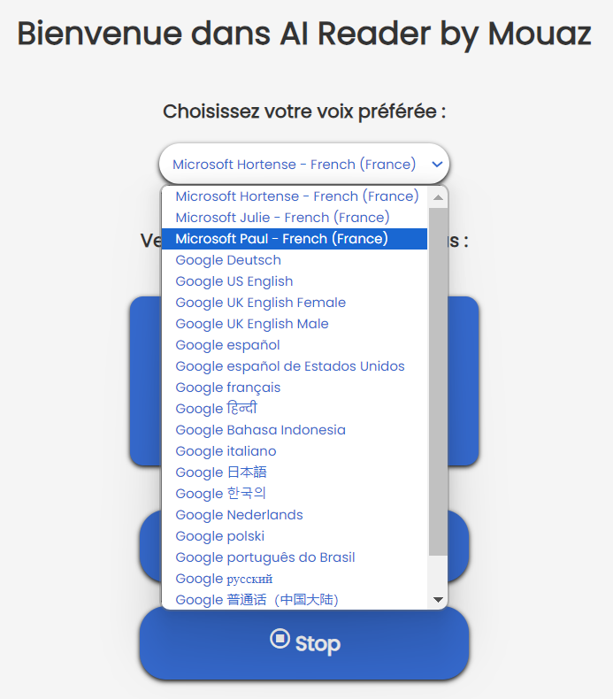
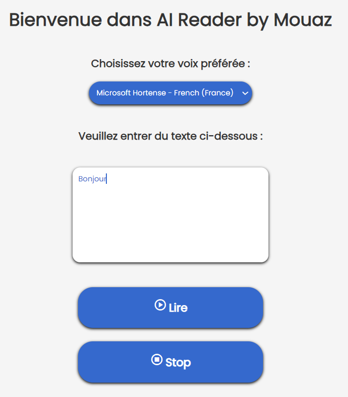
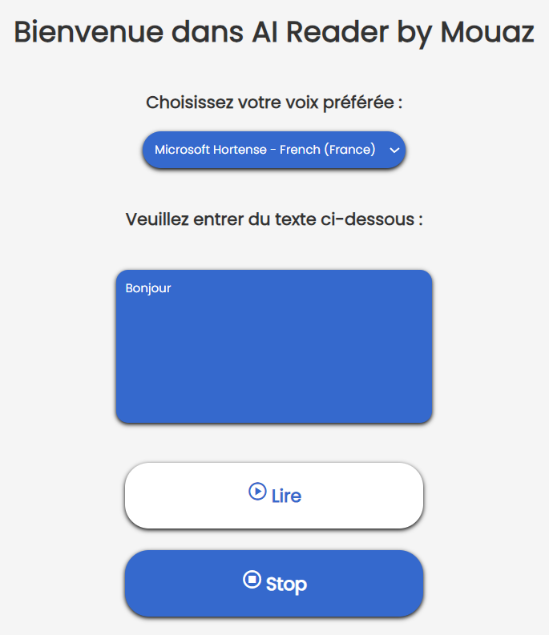
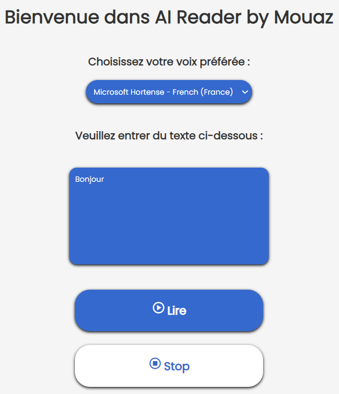

# Projet Personnel chez TiqTec (Stage) ~ AI Reader ~ Mouaz MOHAMED
Mon projet personnel est un site Web développé en HTML/CSS et JavaScript permettant de faire lire à voix haute par l'intelligence artificielle un texte que l'on a écrit avec un choix multiple de voix/langues grâce à une API (Application Programming Interface ou Interface de Programmation d'Application).<br>
Vous pouvez accéder à mon site Web hébergé par Render : [AI Reader by Mouaz](https://ai-reader-by-mouaz.onrender.com)

---

## Diagramme des cas d'utilisation (User Case Diagram) de mon site Web


---

## Accueil de mon site Web
Voici l'accueil de mon site Web : <br>
 <br>

---

## Choisir la voix de l'intelligence artificielle
Nous pouvons choisir la voix que nous préférons à travers la liste déroulante : <br>
 <br>

---

## Ecrire le texte souhaité
Nous pouvons écrire le texte que nous voulons dans le champ de texte prévu à cet effet : <br>
 <br>

---

## Lire le texte
Nous pouvons faire lire le texte par l'IA avec la voix que nous avons choisi : <br>
 <br>

---

## Stopper la lecture du texte
Nous pouvons également arrêter la lecture du texte par l'IA : <br>
 <br>

---

## Démonstration de mon site Web
 <br>

---

## Code pour le bouton Lire
```javascript
function lire()
{
	// Récupérer le texte de l'élément textarea
	var texte = document.getElementById('texte').value;

	// Créer un objet de synthèse vocale
	var syntheseVocale = window.speechSynthesis;
	var message = new SpeechSynthesisUtterance(texte);

	// Sélectionner la voix
	message.voiceURI = 'native'
	message.lang = 'fr-FR';

	//
	let indexVoice = select.value;
	message.voice = voices[indexVoice];

	// Lire le message
	syntheseVocale.speak(message);
}
```

---

## Code pour le bouton Stop
```javascript
function stop()
{
	// Récupérer le texte de l'élément textarea
	var texte = document.getElementById('texte').value;

	// Créer un objet de synthèse vocale
	var syntheseVocale = window.speechSynthesis;
	var message = new SpeechSynthesisUtterance(texte);

	// Sélectionner la voix
	message.voiceURI = 'native'
	message.lang = 'fr-FR';

	// Arrêter le message
	syntheseVocale.cancel(message);
}
```

---

## Code pour la selection de voix
```javascript
let voices;
let select = document.getElementById('select');

// Récupérer les voix à partir du tableau voices
speechSynthesis.onvoiceschanged = function()
{
	voices = window.speechSynthesis.getVoices();
	voices.forEach(function(item, i)
	// item -> Les voix du tableau qu'on va parcourir
	// i -> Index du tableau
	{
	// <option> </option> -> Choix dans le select
	let opt = document.createElement('option');

	// <option value="i"> </option>
	opt.value = i; // Valeur qui est l'index du tableau

	// <option value="i">item.name</option> -> Afficher publiquement le nom de la voix qu'on va utiliser
	opt.innerText = item.name; // Récupérer les noms des voix

	// Ajouter le nom des voix dans le select
	select.appendChild(opt);
	});
}
```
